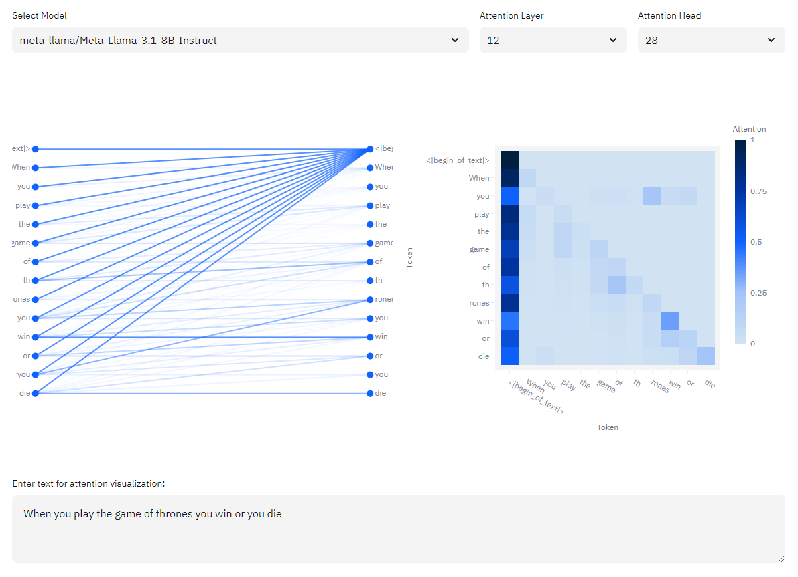

# 🤖 LLMPlayground
LLMPlayground is a Streamlit application designed for visualizing next token predictions and attention filters for open-source Large Language Models (LLMs).

<p align="center">
    
    
</p>

## 🚀 Installation

### 🖥️ System Requirements
To get the best experience with LLMPlayground, you'll need a CUDA-compatible GPU. I tested this on an NVIDIA RTX 2070 with 8GB of RAM. For CUDA installation, follow the [official NVIDIA CUDA Installation Guide](https://docs.nvidia.com/cuda/cuda-installation-guide-microsoft-windows/index.html) and grab version 12.1 of the toolkit.

### 🛠️ Setting Up PyTorch
Install PyTorch with CUDA support by running the following command:
```bash
pip install torch torchvision torchaudio --index-url https://download.pytorch.org/whl/cu121
```
---
### 🔑 Environment Variables
Set up a `.env` file in the root of your project directory with the following keys to configure the environment:

```plaintext
HUGGING_FACE_API_TOKEN=<your_hugging_face_api_token>
MODELS="meta-llama/Meta-Llama-3.1-8B-Instruct,microsoft/Phi-3-medium-128k-instruct,tiiuae/falcon-7b-instruct,mistralai/Mistral-7B-Instruct-v0.2,google/gemma-2-9b-it,Qwen/Qwen2-7B-Instruct"
BACKEND_URL="http://localhost:5000"
HF_CACHE_DIR=<optional_hugging_face_cache_directory>
```
---
### 📦 Install Dependencies 
to set up a virtual environment and install all the necessary dependencies:

```bash
python -m venv .venv
.venv\Scripts\activate.bat
```

### 🧑‍💻 Running the Backend Server
```bash
flask --app backend.py run
Ive provided a simple script to verify the backend is working:
```
To test the backend:
```bash
python test_backend.py
```
### 🎨 Running the Streamlit Frontend
```bash
streamlit run app.py
```
